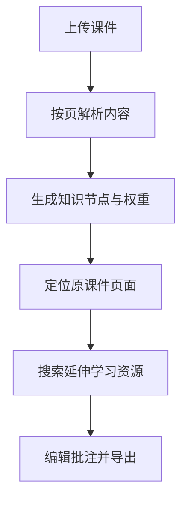

# 主动预习地图 · Active Preview Map

[](#本地运行)
[](https://www.typescriptlang.org/)
[](https://react.dev/)
[](LICENSE)

把 PDF、PPTX、TXT 或 Markdown 课件转换成可编辑的主动预习思维导图，并将知识节点、原课件页码和延伸学习资源连接起来。

**在线体验：** https://active-preview-map.hszzha96.chatgpt.site/

## 产品流程



## 核心功能

| 模块 | 能力 |
| --- | --- |
| 课件导入 | 支持 PDF、PPTX、TXT、Markdown，单文件建议不超过 25 MB |
| 自动分析 | 提取页面内容，识别主题、摘要、知识类型与所属模块 |
| 权重系统 | 按核心度、考试概率、前后依赖、应用价值、易混程度综合评分 |
| 模板系统 | 通用预习、考试冲刺、数据分析、编程实践、商业案例、数学公式 |
| 原页定位 | 从知识节点直接打开对应 PDF 页面或 PPTX 提取原文 |
| 延伸学习 | 自动生成检索词，连接视频、公开课、论文、教材和练习资源 |
| 编辑与导出 | 支持修改节点、标记和批注，并导出 JSON、CSV 或打印为 PDF |
| 本地隐私 | 课件在浏览器本地解析，默认不上传或保存原始文件 |

## 延伸学习来源

- 视频：YouTube、哔哩哔哩
- 公开课：Coursera、edX、MIT OpenCourseWare
- 权威阅读：Google Scholar、Semantic Scholar、Wikipedia
- 动手练习：Kaggle、GitHub

当前版本采用“自动检索词 + 定向搜索入口”，不需要额外 API 密钥。未来可接入平台 API，在站内直接展示和排序结果。

## 本地运行

### 环境要求

- Node.js `>= 22.13.0`
- pnpm `11.25.0`

### 安装与启动

```bash
git clone <your-repository-url>
cd active-preview-map
corepack enable
pnpm install --frozen-lockfile
pnpm dev
```

默认开发地址通常为 `http://localhost:5173`。

### 质量检查

```bash
pnpm lint
pnpm build
```

### 预览生产构建

```bash
pnpm start
```

## 项目结构

```text
active-preview-map/
├── app/
│   ├── page.tsx          # 产品主界面与核心逻辑
│   ├── globals.css       # 主题与响应式样式
│   └── layout.tsx        # 页面元数据与根布局
├── components/ui/        # 可复用 UI 组件
├── public/               # 图标与静态资源
├── docs/                 # 架构、部署与发布说明
├── .github/              # CI、Issue 与 PR 模板
├── package.json
└── pnpm-lock.yaml
```

## 数据与隐私

- PDF、PPTX 和文本内容默认只在当前浏览器内解析。
- 项目不会自动把课件上传到服务器。
- PDF 通过浏览器对象 URL 预览；关闭或刷新页面后对象 URL 失效。
- 延伸学习按钮只把自动生成的知识点检索词发送给用户选择的平台。
- 不要在公开 Issue 中上传课程原件、个人资料或受版权保护的内部文件。

## 技术栈

- React 19 + TypeScript
- Vinext / Next-compatible App Router
- Tailwind CSS 4
- Radix UI / shadcn-style primitives
- PDF.js：PDF 文本解析与页面定位
- JSZip：PPTX XML 文本提取
- Lucide React：界面图标
- Cloudflare Worker 兼容构建

## 文档

- [架构说明](docs/ARCHITECTURE.md)
- [部署指南](docs/DEPLOYMENT.md)
- [发布检查清单](docs/RELEASE_CHECKLIST.md)
- [贡献指南](CONTRIBUTING.md)
- [安全政策](SECURITY.md)
- [版本记录](CHANGELOG.md)

## 当前限制

- 扫描版 PDF 需要先进行 OCR。
- PPTX 当前提取文字与页码，不会完整还原动画、复杂图表和所有视觉排版。
- 延伸学习资源在外部平台打开，搜索结果质量由对应平台决定。
- 页面刷新后，尚未导出的编辑内容不会自动保存。

## Roadmap

- [ ] 站内展示 YouTube、论文和公开课搜索结果
- [ ] 资源可信度、难度、语言和时长排序
- [ ] AI 五分钟讲解、费曼解释和自动测验
- [ ] 学习进度、收藏与稍后复习
- [ ] OCR 与更完整的 PPTX 页面渲染
- [ ] 多课程知识图谱和跨课件关联

## 参与贡献

欢迎提交 Issue 或 Pull Request。提交前请运行：

```bash
pnpm lint
pnpm build
```

详细流程见 [CONTRIBUTING.md](CONTRIBUTING.md)。

## License

本项目采用 [MIT License](LICENSE)。
