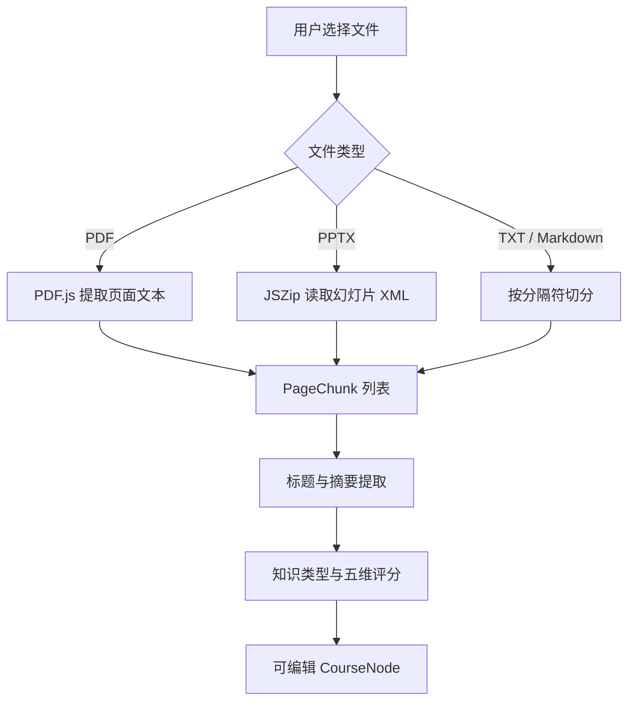

# 架构说明

## 目标

主动预习地图把线性课件转换成三层学习结构：

1. **知识地图层**：理解课程整体结构与重点。
2. **原课件层**：返回对应页核对上下文。
3. **延伸学习层**：寻找视频、课程、阅读和练习资源。

## 数据流



## 主要数据模型

### PageChunk

```ts
type PageChunk = {
  page: number;
  text: string;
};
```

表示课件中的一个页面或文本分段。

### CourseNode

包含页码、模块、标题、摘要、批注、知识类型、原文依据、五维评分、综合权重和重点标记。

## 权重计算

每个节点包含五项 `1–5` 分评分：核心度、考试概率、前后依赖、应用价值和易混程度。

用户配置的百分比权重会归一化，最终转换为 `0–100` 的节点权重。节点标记根据综合权重与部分评分规则生成，并允许用户手动覆盖。

## 原课件定位

- PDF：保留浏览器对象 URL，通过 `#page=` 定位页面。
- PPTX：按 `slide1.xml`、`slide2.xml` 顺序提取文本并保留页码。
- TXT / Markdown：按章节分隔符转换为虚拟页码。

## 延伸学习

检索词由当前页对应节点的标题和知识类型生成，并根据语言偏好增加“详细讲解、原理、例子”等意图词。外部平台 URL 在点击时动态创建，不在项目中保存用户查询历史。

## 隐私设计

当前版本是客户端优先架构：

- 文件解析发生在浏览器；
- 不要求用户账号；
- 不需要数据库；
- 不存储课件内容；
- 外部资源只有在用户点击时才接收检索词。
